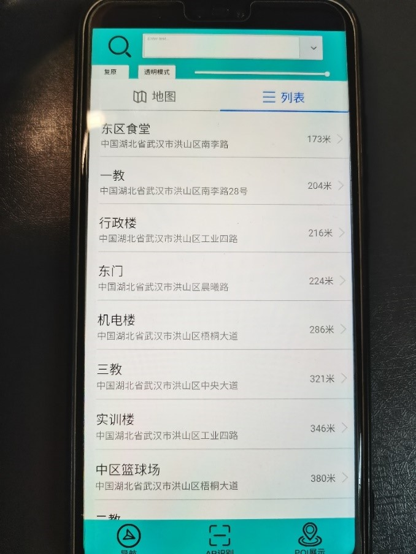
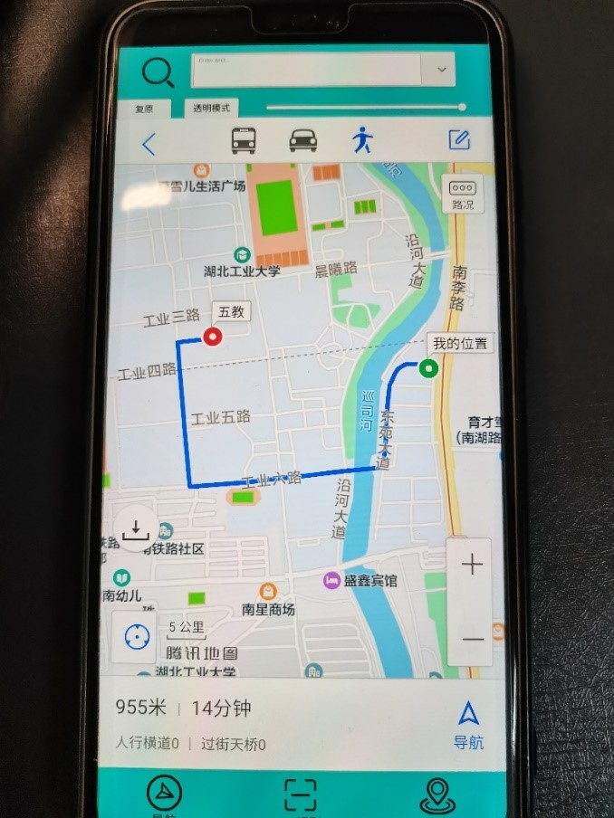
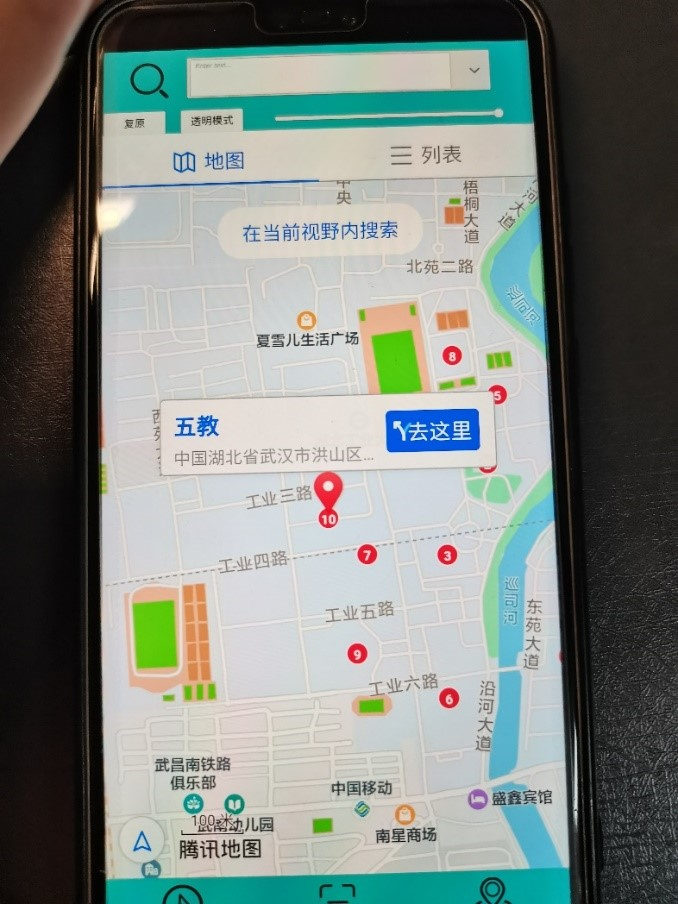

# Campus Explorer AR Navigation System
An AR-based navigation system for campus exploration using Unity and C#. Utilized the Vufouria plugin to manage images and implement AR image recognition.

## Screenshots
### Feature 1: Navigation in campus
||||

### Feature 2: Points of Interest(POI) display

### Feature 3: Augmented reality(AR) recognition 
||

## Features
Feature 1: Navigation in campus

Feature 2: Points of Interest(POI) display

Feature 3: Augmented reality(AR) recognition 

## Getting Started
Waiting for the update

## Built With
**Unity** - Unity is a game engine for building 2D and 3D games and interactive content. It provides tools for design, development and asset management, and supports multiple platforms.

**Vuforia** - Vuforia is a computer vision library for mobile devices that allows for the creation of augmented reality (AR) experiences. It provides tools for image and object recognition, as well as environment tracking, enabling developers to overlay digital content onto the real world. Vuforia is integrated with the Unity engine and can be used to create interactive AR apps for iOS and Android devices.
## Authors
Xiangyi Zhou - https://github.com/xiangyi-zhou
## License
This project is licensed under the MIT License - see the LICENSE file for details.

