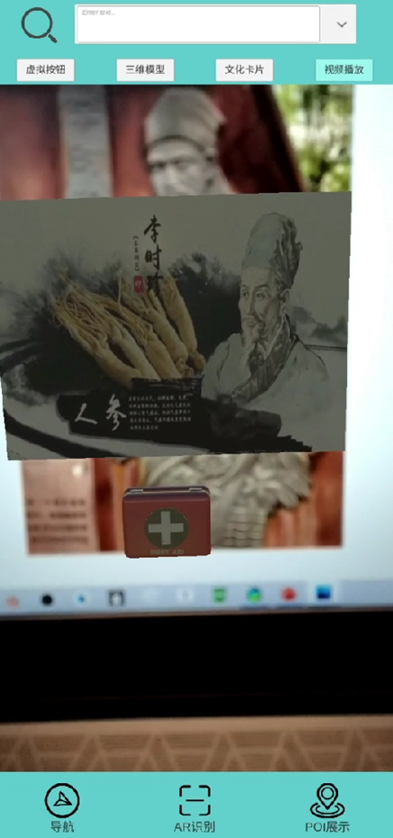

# Campus Explorer AR Navigation System
An AR-based navigation system for campus exploration using Unity and C#. Utilized the Vufouria plugin to manage images and implement AR image recognition.

## Screenshots

### Feature 1: Navigation in campus
  ||

  |

### Feature 2: Points of Interest(POI) display

### Feature 3: Augmented reality(AR) recognition 
||

## Features
Feature 1: Navigation in campus

Feature 2: Points of Interest(POI) display

Feature 3: Augmented reality(AR) recognition 

## Getting Started

1. Download and install Unity on your computer from the https://unity.com/.
2. Download and import the Vuforia library into your Unity project from the https://developer.vuforia.com/downloads/sdk.
3. Clone or download the AR campus explorer system repository from Github
4. Open the project in Unity and ensure that the Vuforia library is properly set up and integrated.
5. Build the project for Android and deploy it to your device.
6. Open the AR campus explorer app on your device and point your camera at the predefined targets to start exploring the campus.

**Note**: Your android phone must have a **gyroscope** to use the POI (Points of Interest) display function. If your device does not have a gyroscope, some features of the app may not be available.

## Built With

Unity 2018.4.4f1 - The game engine used

C# - The programming language used

Vuforia - The AR library used

## Authors
Xiangyi Zhou - https://github.com/xiangyi-zhou
## License
This project is licensed under the MIT License - see the LICENSE file for details.

## Copyright Notice
Please be aware that this project includes unique content such as real pictures from our campus and a POI database. This content is protected by copyright laws and cannot be used or replicated without permission. Additionally, the code and database used in this project are also protected by copyright laws and cannot be used or replicated without permission. This project is for non-commercial use only.
